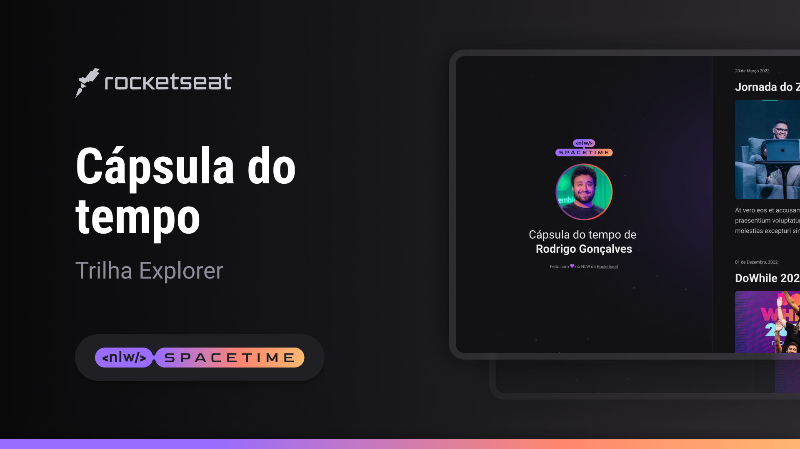

    

## 🖥 Projeto 
Esse é um projeto responsivo de uma cápsula do tempo para exibir memórias em uma linha do tempo.

## 🛰 Tecnologias
Esse projeto foi desenvolvido durante a nlw com as seguintes tecnologias:

- HTML
- CSS
- git e github

## 🍄 Layout
Você pode vizualizar o layout do projeto através 
[desse link](https://www.figma.com/file/jKLqiWP4Z7qJ1316wpKOWz/C%C3%A1psula-do-tempo-%E2%80%A2-Trilha-Explorer-(Community)-(Copy)?type=design&node-id=306%3A3&t=lQOTDnh6A9T0BEdx-1).
É necessário ter uma conta no [figma](https://www.figma.com/).